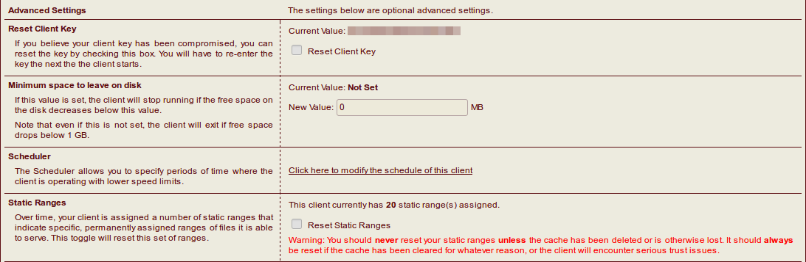
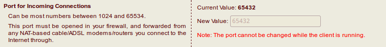
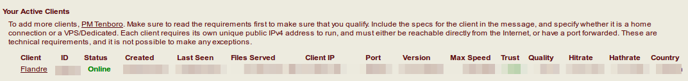

# HentaiAtHome

## Requirement

- [Docker](https://docs.docker.com/engine/installation/)
- [docker-compose](https://docs.docker.com/compose/install/)
- H@H ID

## H@H settings

Go [Hentai@Home](https://e-hentai.org/hentaiathome.php) page & click client name to the setting page

**Reset Client Key** and **Reset Static Ranges** at first time



Set **port** at top



then <kbd>Apply</kbd> settings

## Install

1. Copy **docker-compose.yml** into a folder
2. Edit `PORT`, `HATH_CLIENT_ID`, and `HATH_CLIENT_KEY` in **docker-compose.yml** to yours

then

```sh
$ docker-compose up -d
```

## Check

```
$ docker ps
```

or



## Q&A

https://ehwiki.org/wiki/Technical_Issues#H.40H

https://github.com/FlandreDaisuki/HentaiAtHome/issues

## Credits

Thank the dockerfile from [frosty5689/docker-hath](https://github.com/frosty5689/docker-hath)
