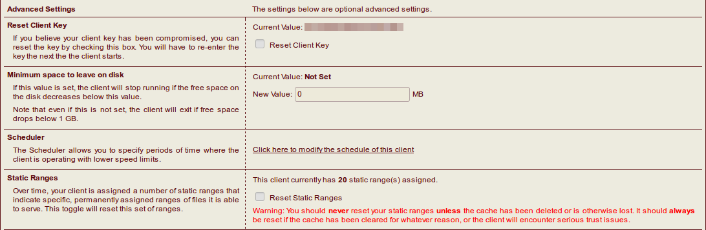
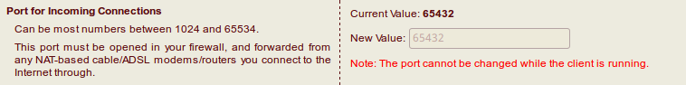
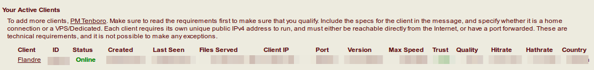

# HentaiAtHome

## Requirement
- [Docker](https://docs.docker.com/engine/installation/)
- H@H ID

## H@H settings

Click client name to setting page

**Reset Client Key** and **Reset Static Ranges** at first time



Set **port** at top



## Install

```
$ git clone https://github.com/FlandreDaisuki/HentaiAtHome.git
$ cd HentaiAtHome
```

Edit `HOST_PORT` in `setup.run` to yours.
Then

```
$ ./setup.run
```

then

- enter your Client ID
- enter your key

at the first time then close terminal

## Check

```
$ docker ps
```

or



## Q&A

https://ehwiki.org/wiki/Technical_Issues#H.40H

https://github.com/FlandreDaisuki/HentaiAtHome/issues
